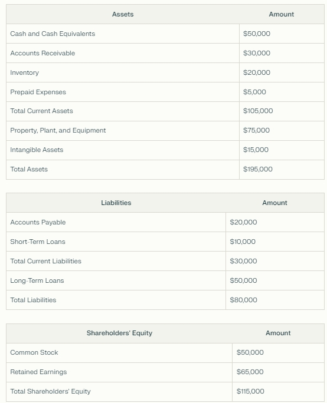

# Fundamentals

The **Internal Rate of Return (IRR)** is a way of calculating the profitability of an investment considering contributions and sales of assets of various amounts (in this case, the sale only takes place at the end, and the contributions have constant values more the dividends distributed). We can interpret the **IRR** as an application of compound interest at more complex situations. In our case, the lump sum contributions plus dividends were calculated for a period of 10 years (or 5 years for newer companies on the stock exchange).

**Net Income/Loss** represents the company's profitability after deducting all general, financial, depreciation and tax expenses. A company considered profitable for us is a company with increasing profits over the years.

In accounting, **Research and Development** are considered expenses, but for us, it is considered an investment.

When the annual "Expenses" of **R\&D** increases, it means that the company is active with innovation and we could expect surprises for the future of the company and a possible increase of the Net income.

The balance sheet of a company financially represents everything that is used in the operation of the company alongside all its financial obligations. To do this, the balance sheet is divided into three main parts: assets, liabilities and shareholders' equity.

Below is a simplified example of a balance sheet:

Assets are all the company's property and rights, such as machinery and cash on hand, whether obtained with third-party capital (Liabilities) or owners’ capital (Equity).

Liabilities represent all the company's financial obligations to third parties, such as debts and accounts payable.

If we subtract the assets from the total liabilities, we get the shareholders' equity, which consists mainly of the company's share capital. So, mathematically: Assets = Liabilities + Equity.

If we divide equity by total assets, we find the **Equity Ratio**, a metric that shows the proportion of total assets that is financed by shareholders' capital. The higher this metric, the less the company depends on third-party capital and/or debt.

We can also divide assets and liabilities into current (or short-term) assets and liabilities. If we divide current assets by current liabilities, we get the **Current Ratio**, which shows the company's ability to pay its short-term obligations with its short-term assets.